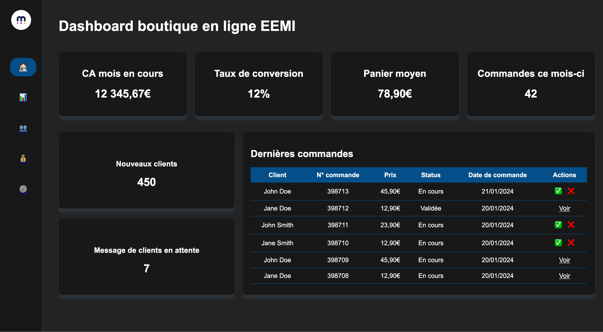

# Partiel HTML / CSS - 1A C3 | EEMI

## Instruction
**Objectif** : Reproduire en 2 heures le dashboard d'une boutique en ligne. Le design à reproduire est présenté dans la section "Design". Des emojis suffisent pour les images (sauf pour le logo de l'EEMI).

**Technologies autorisées** : HTML, CSS (flexbox et grid autorisés). 

**Interdits** : Librairies et frameworks CSS/JavaScript.

## Design
### Desktop

### Effet visuel sur desktop

### Tablette

### Téléphone

### Effet visuel sur téléphone

## Rendu attentu
Un fichier zip contenant un fichier HTML, un fichier de style CSS. Des fichiers d'images si nécessaire. Hormis le fichier HTML, tous les fichiers doivent être rangés dans des dossiers adéquats.

## Critères d'évaluations
| Critère | Points |
|---|---|
| Code propre, structuré et bien indenté | 4 |
| Design proche de celui fourni dans le sujet | 5 |
| Navbar (logo + 5 liens avec icônes les uns en dessous des autres + bordure droite) | 3 |
| Respect hiérarchie des titres h1 > h2 > h3 | 0,25 |
| Classe partagée pour les widgets | 2 |
| Ombre widget | 0,25 |
| Tableau de commande | 4 |
| Effet hover widget (changement d'ombre) | 0,5 |
| Effet hover tableau de commande (changement de fond + couleur texte) | 0,75 |
| Effet hover lien navbar | 0,25 |
| Favicon | 0,25 |
| Titre de l'onglet | 0,25 |
| CSS dans un fichier spécifique | 1 |
| W3C validator ([https://validator.w3.org/#validate_by_input](https://validator.w3.org/#validate_by_input)) erreur = 0, warning = 0,5 | 1
| Responsive sur téléphone (design mono colonne) | 7 |
| Responsive sur tablette | 6 |
| Navbar en haut avec logo qui disparaît sur téléphone | 1,5 |
| Tableau scrollable horizontalement sur petit support | 2 |
| Changement de taille de police des titres selon la taille de l'écran | 1 |
| *[BONUS] Variable CSS* | *1* |
| **TOTAL** | **40** |